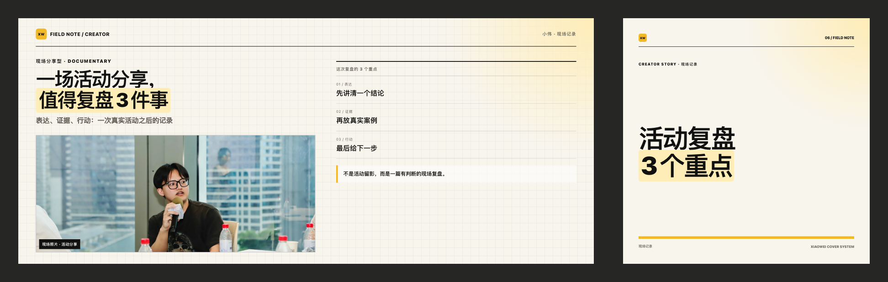
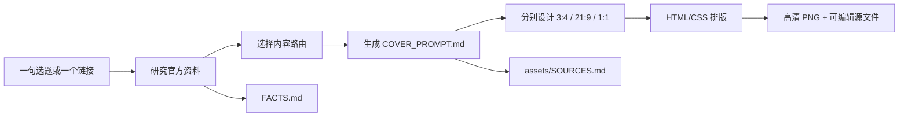
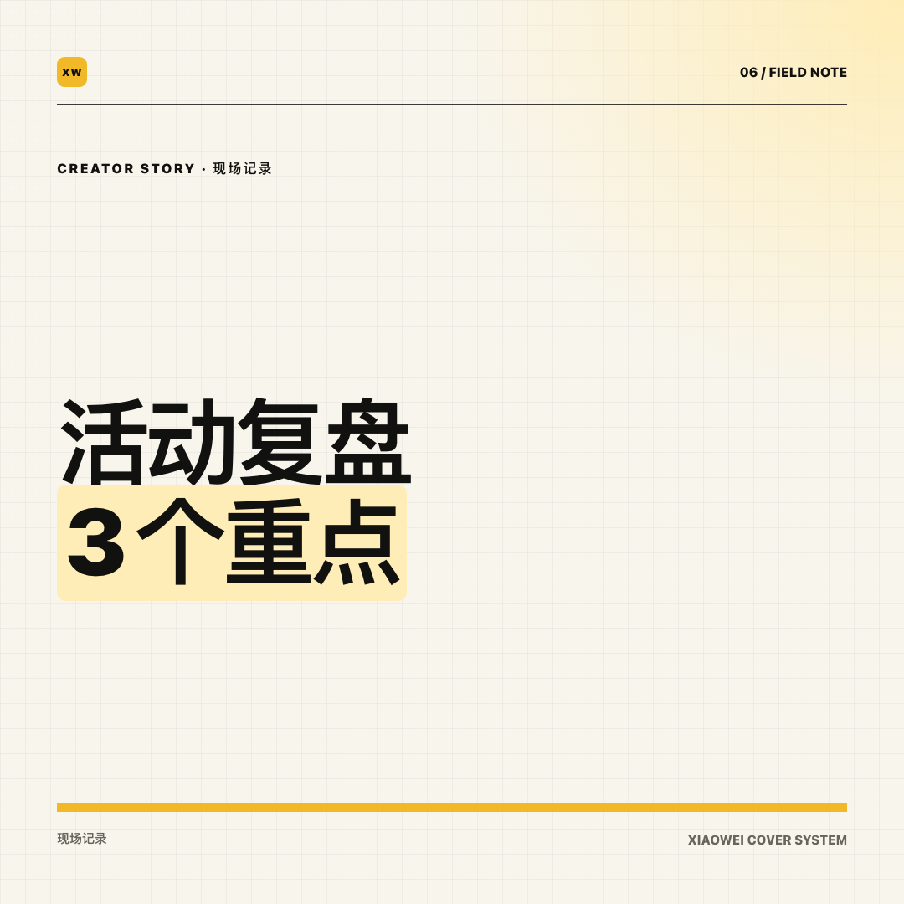
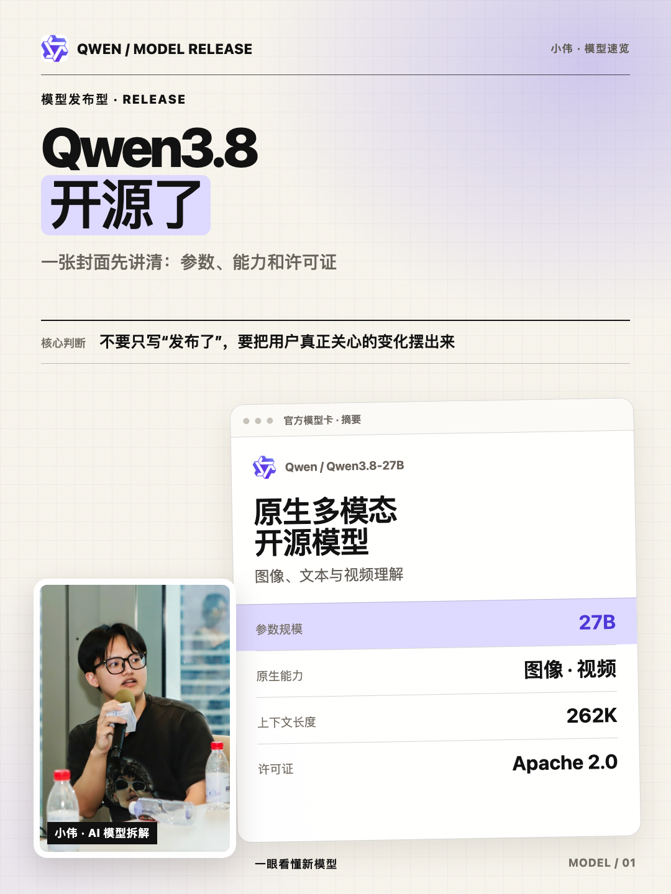
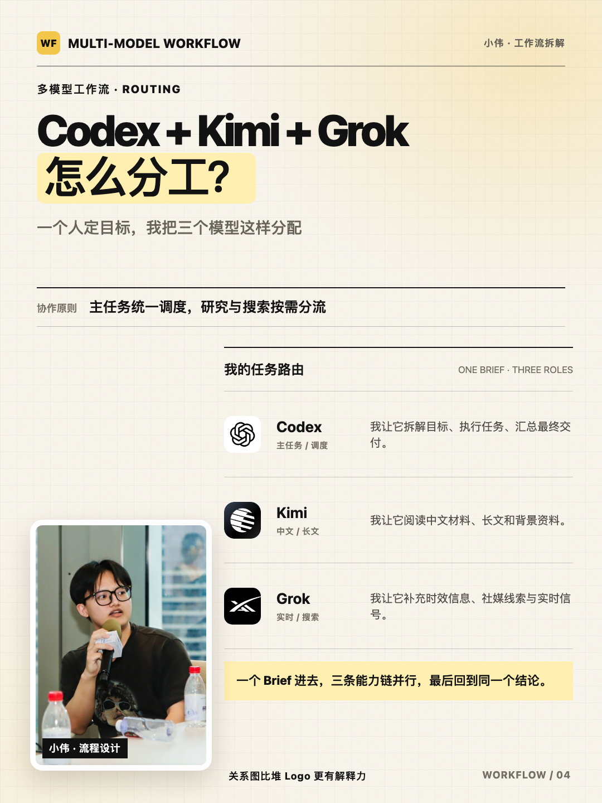

# 小伟 AI 封面 Skill

> 一句话选题，变成一份可复用的封面提示词，以及一套真正能讲清内容的小红书与公众号封面。

[English](README.en.md) · [高清成品画廊](docs/gallery.md) · [可复制示例](docs/usage-examples.md) · [系统架构](docs/architecture.md)

[](https://github.com/siuserxiaowei/generate-xiaowei-covers/actions/workflows/validate.yml)
[](LICENSE)

[](docs/images/showcase/wechat/hero-field-recap-pair-1944x620.png)

这是一个面向中文 AI 内容创作者的 Codex Skill。你可以只给它一句选题、一个官方链接、一篇文稿、一张截图或一张现场照片，它会：

1. 理解这篇内容真正要讲什么；
2. 查找并核对官方资料；
3. 在六种内容结构中选择合适的一种；
4. 生成项目专属的 `COVER_PROMPT.md` 封面提示词；
5. 为小红书 3:4、公众号 21:9 和公众号 1:1 分别排版；
6. 导出高清 PNG、可编辑 HTML、事实台账和素材来源。

它不是让图片模型“随便画一张好看的海报”。它要解决的是：

- 读者能不能在缩略图里一眼看懂这篇内容讲什么；
- 标题里的版本、参数和结论有没有依据；
- 截图、模型卡、流程图和现场照片能不能证明主题；
- 人物是否完整、自然，而不是被粗暴抠图或裁断；
- 不同平台是否真正重新设计，而不是机械裁图。

## 一句话就能开始

最小请求：

```text
$generate-xiaowei-covers

把这个官方链接做成小伟风格的公众号和小红书封面。
请先核对事实，人物放在 3:4 和 21:9 左下，方图单独排版。
```

更具体的请求：

```text
$generate-xiaowei-covers

Qwen 新版开源了，帮我做公众号和小红书封面。
重点讲它真正新增了什么，官方资料你自己查。
不要写没有来源的性能排名。
人物放 3:4 和 21:9 左下，保留脸、手、话筒和桌面。
```

## 从一句话到最终图片



一次任务的核心交付物：

| 文件 | 它解决什么问题 |
|---|---|
| `COVER_PROMPT.md` | 把选题、标题、证据、人物、光线、镜头和排版写成可复用的封面提示词 |
| `cover.html` | 可继续编辑的 HTML/CSS 封面源文件 |
| `output/*.png` | 小红书、公众号横版、公众号方版等高清成品 |
| `FACTS.md` | 记录封面中每条版本、日期、参数、价格和结论的依据 |
| `assets/SOURCES.md` | 记录人物、Logo、截图和外部素材的来源与使用边界 |

## 先理解四个概念

### 1. 封面 Skill

`SKILL.md` 是执行协议。它规定 Codex 如何理解选题、何时搜索官方资料、怎样选择内容结构、如何安排人物和证据，以及最后怎样渲染和检查。

Skill 负责“判断与执行流程”，不是一张固定海报。

### 2. 封面提示词

这里的封面提示词不是一句“生成一张高级感图片”。

`COVER_PROMPT.md` 会具体写清：

- 内容对象、受众和点击理由；
- 主标题、副标题、高亮短语和精确换行；
- 采用哪一种内容路由，以及为什么；
- 应该放官方模型卡、真实 UI、同题对比、流程图还是现场照片；
- 主体、环境、气质、光线、镜头和排版六个可见维度；
- 人物位置与必须保留的脸、手、话筒、桌面等上下文；
- 3:4、21:9、1:1 三种画幅各自如何构图；
- 必须出现、必须避免和不能伪造的内容。

它更像“给设计师和排版系统的执行稿”，也可以复制给其他图像或设计工具继续使用。

### 3. HTML/CSS 模板

标题和数据使用 HTML/CSS 排版，而不是交给图片模型生成。这样可以避免中文错字、数字变形、Logo 乱码以及不同画幅之间的失控裁切。

### 4. PNG 渲染器

渲染器使用 Playwright 或本机 Chrome，把标记为 `data-export` 的画面导出为确定尺寸的 PNG，并保留可编辑 HTML。

所以这套系统的完整链路是：

> 内容判断 + 官方核验 + 封面提示词 + 结构化排版 + 多尺寸导出

## 一个真实的封面提示词长什么样

下面是 `COVER_PROMPT.md` 的简化片段：

```text
内容路由：model_release
读者点击价值：快速知道这次正式发布了什么，以及谁值得关注
核心结论：重点不是参数变大，而是能力边界发生了什么变化

小红书 3:4 标题：Qwen 新版开源了
公众号 21:9 标题：Qwen 新版开源
公众号 1:1 短标题：Qwen 开源

主体：完整环境中的作者人物照片，位于左下
环境：真实活动或工作场景，保留桌面、话筒与上下文
气质：浅色纸张、克制细网格、黑色粗标题、单一黄色强调
光线：保留真实照片光线，不生成不存在的现场光影
镜头：人物与证据区分层，脸部不压标题
排版：标题优先，官方模型卡作为主证据，360px 缩略图仍可读

禁止：虚构跑分、伪造官方页面、机械裁切方图、截断手部
```

完整字段见 [封面提示词模板](assets/COVER_PROMPT.template.md)。

## 六种内容路由

六个 route 是六种内容骨架，不是同一张海报换六种颜色。

| 类型 | 什么时候使用 | 封面必须回答 | 主要证据 |
|---|---|---|---|
| 模型发布 `model_release` | 新模型、开源、版本、价格或能力变化 | 这次发布了什么？对谁有用？ | 官方发布页、模型卡、官方仓库 |
| 工具教程 `tool_tutorial` | 安装、配置、部署、接入、排错 | 跟着这篇能完成什么？ | 真实 UI、终端结果、前后对比 |
| 模型对比 `model_comparison` | 多个模型处理同一任务 | 它们到底差在哪里？ | 同条件测试矩阵 |
| 多模型工作流 `workflow` | Codex、Kimi、Grok 等如何分工 | 谁负责什么？怎样衔接？ | 角色图、流程图、实际记录 |
| 官方资料 `official_evidence` | Release note、公告、论文或模型卡解读 | 原文真正改变了什么？ | 原始资料与关键段落 |
| 现场复盘 `field_recap` | 活动、演讲、项目、实测与阶段总结 | 我亲自经历后得到什么？ | 完整现场照片、第一人称结论 |

选择 route 的依据是“读者点开后首先得到什么”，不是画面里出现哪个 Logo。

例如同样是 Qwen 发布：

- 文章重点是发布内容 → `model_release`；
- 文章重点是三项统一实测 → `model_comparison`；
- 文章重点是作者参加活动后的判断 → `field_recap`。

## 三种画幅，三套独立构图

| 发布面 | 生产尺寸 | 核心规则 |
|---|---:|---|
| 小红书竖版 | `1080×1440` | 标题在上半区，人物左下，证据位于中下或右下 |
| 公众号主封面 | `2100×900` | 标题与人物在左，主证据占右侧约一半 |
| 公众号方封面 | `1080×1080` | 单独写 4–10 字短标题，默认纯排版，不裁横图 |

公众号任务还会生成一张 `1944×620` 横版 + 方版配对预览，专门检查两张图是否真的属于同一内容包。

人物不是贴在角落的装饰贴纸：

- 3:4 与 21:9 默认人物左下；
- 优先保留脸、手、话筒、桌面和动作上下文；
- 优先使用完整环境照片，避免粗糙抠图；
- 1:1 默认纯排版，以保证微信列表缩略图可读；
- 如果 1:1 必须出现人物，会重新构图，而不是裁切横版。

## 高清成品

下面直接引用原始 PNG。点击图片可以查看完整分辨率。

### 公众号：2100×900 + 1080×1080

<table>
  <tr>
    <td width="65%"><a href="docs/images/showcase/wechat/field-recap-2100x900.png"></a></td>
    <td width="35%"><a href="docs/images/showcase/wechat/field-recap-1080x1080.png"></a></td>
  </tr>
  <tr>
    <td align="center"><code>2100×900</code> 横版</td>
    <td align="center"><code>1080×1080</code> 独立方版</td>
  </tr>
</table>

### 小红书：1080×1440

<table>
  <tr>
    <td width="33%"><a href="docs/images/showcase/xiaohongshu/01-model-release-1080x1440.png"></a></td>
    <td width="33%"><a href="docs/images/showcase/xiaohongshu/04-workflow-1080x1440.png"></a></td>
    <td width="33%"><a href="docs/images/showcase/xiaohongshu/06-field-recap-1080x1440.png"></a></td>
  </tr>
</table>

六种结构的公众号配对图和小红书原图见 [高清成品画廊](docs/gallery.md)。

## 安装到 Codex

### 方式一：HTTPS

```bash
mkdir -p ~/.codex/skills

git clone \
  https://github.com/siuserxiaowei/generate-xiaowei-covers.git \
  ~/.codex/skills/generate-xiaowei-covers
```

### 方式二：GitHub CLI

```bash
mkdir -p ~/.codex/skills

gh repo clone siuserxiaowei/generate-xiaowei-covers \
  ~/.codex/skills/generate-xiaowei-covers
```

重新打开 Codex 会话，然后输入：

```text
$generate-xiaowei-covers
```

这是一个 Codex Skill，不是独立在线网站。两个 Node.js 脚本也可以单独运行，但自动研究、内容判断和提示词填写仍需要 Codex 执行 Skill。

## 可直接复制的请求模板

```text
$generate-xiaowei-covers

主题：
来源链接：
发布平台：小红书 / 公众号 / 两者都要
希望读者记住的一句话：
必须出现：
不要出现：
人物或产品素材：
重点证据：官方模型卡 / UI 截图 / 对比矩阵 / 工作流 / 官方原文 / 现场照片

请先核对官方资料，然后给出：
1. 内容路由与选择理由；
2. 三个标题候选；
3. 完整 COVER_PROMPT.md；
4. 各画幅独立排版；
5. 高清 PNG、可编辑 HTML、FACTS.md 和 SOURCES.md。
```

你不需要把所有字段填满。只有作者立场、素材权利、隐私或关键事实会实质改变结果时，Skill 才应该追问。

更多请求范例见 [docs/usage-examples.md](docs/usage-examples.md)。

## 手动使用 CLI

前置环境：

- Node.js 20 或更高版本；
- Google Chrome，或者当前项目中可用的 Playwright；
- macOS 已完整验证，其他系统建议使用 Playwright。

### 1. 创建项目

```bash
SKILL_DIR="$HOME/.codex/skills/generate-xiaowei-covers"

# 小红书六种 1080×1440 结构
node "$SKILL_DIR/scripts/new-cover-project.mjs" ./my-cover vertical

# 公众号六组 2100×900 + 1080×1080
node "$SKILL_DIR/scripts/new-cover-project.mjs" ./my-wechat-cover wechat
```

新项目结构：

```text
my-cover/
├── COVER_PROMPT.md
├── FACTS.md
├── cover.html
├── LICENSE
├── assets/
│   ├── portrait/
│   ├── brand/
│   └── SOURCES.md
└── output/
```

目标目录已经存在时，创建脚本会拒绝覆盖。

### 2. 只导出需要的 route

```bash
node "$SKILL_DIR/scripts/render-covers.mjs" \
  ./my-wechat-cover/cover.html \
  ./my-wechat-cover/output \
  --only release
```

公众号 `release` 会得到：

```text
wechat-01-release-21x9.png
wechat-01-release-1x1.png
wechat-01-release-pair-preview.png
```

精确导出单个节点：

```bash
node "$SKILL_DIR/scripts/render-covers.mjs" \
  ./my-wechat-cover/cover.html \
  ./my-wechat-cover/output \
  --only wechat-release-wide
```

`--only` 可以匹配 route、节点 ID、`data-file` 文件名或逗号分隔的多个 token。不传时会导出模板中的全部 `[data-export]` 节点。

## 事实和素材为什么要单独记录

### `FACTS.md`

封面里的版本号、发布日期、参数、价格、排名、许可证和“最新”“首次”“最强”等表达都必须有原始来源。

Skill 会记录：

```text
精确封面文案 → 事实/观点分类 → 官方 URL → 核验日期 → 证据位置
```

`FACTS.md` 是人工发布门禁；渲染器本身不会自动判断真假。

### `assets/SOURCES.md`

人物照片、Logo、截图、模型卡和外部图片要记录：

- 原始 URL 或提供者；
- 获取日期；
- 在封面中的用途；
- 许可证、商标、肖像或隐私备注。

公开发布前仍应确认素材许可。仓库内的品牌图片是演示与产品指称用途，不代表厂商合作、背书或对商标的重新授权。

## 它不是什么

它不是：

- Midjourney、Stable Diffusion 或其他纯图片生成器；
- Canva 式任意拖拽在线编辑器；
- 自动编造跑分、排名或个人体验的内容机器；
- 给所有选题套同一张固定海报的换字工具；
- 自动授予第三方 Logo、截图或人物照片使用权的素材库。

它更像一个“有事实门槛的封面编排助手”：先判断内容，再形成提示词和版式，最后稳定地生成图片。

## 仓库结构

```text
generate-xiaowei-covers/
├── SKILL.md                       # Codex 执行协议
├── agents/openai.yaml             # Skill 列表展示与默认请求
├── assets/
│   ├── COVER_PROMPT.template.md   # 封面提示词模板
│   ├── FACTS.template.md          # 事实台账模板
│   ├── SOURCES.md                 # 默认素材来源
│   ├── templates/                 # 竖版与公众号 HTML 模板
│   ├── portrait/                  # 默认人物素材
│   └── brand/                     # 模型/工具演示素材
├── references/
│   ├── input-schema.md
│   ├── content-routing.md
│   └── brand-system.md
├── scripts/
│   ├── new-cover-project.mjs
│   ├── render-covers.mjs
│   └── validate-repo.mjs
├── docs/
└── LICENSE
```

内部数据流见 [docs/architecture.md](docs/architecture.md)。

## 验证

```bash
npm test
```

仓库校验会检查：

- Skill frontmatter 和必要文件；
- 模板引用的本地素材；
- 竖版 6 个与公众号 18 个导出节点；
- JavaScript 语法。

发布前还会真实渲染并核对：

- `2100×900` 公众号主封面；
- `1080×1080` 公众号方封面；
- `1944×620` 配对预览；
- `1080×1440` 小红书封面；
- 360px 宽手机缩略图的标题、人物和证据可读性。

## 当前限制

- 当前是 Skill + HTML/CSS 渲染内核，不是在线编辑器；
- 没有 Canva 式任意拖拽，版式约束用于保证一致性；
- `FACTS.md`、品牌使用和最终发布仍需要人工确认；
- 模板文字可编辑，但还没有统一的 `cover.json` 可视化表单；
- 复杂的新 route 仍可能需要调整 HTML，而不是只改一个字段。

## License、原创实现与视觉灵感

本项目的内容路由、封面提示词体系、人物规则、当前模板实现和渲染脚本均围绕本项目独立设计。

早期视觉探索阶段曾受到 [`op7418/guizang-social-card-skill`](https://github.com/op7418/guizang-social-card-skill) 的 Swiss 社交卡 idea 启发；当前公开模板采用独立代码实现。感谢该项目提供的设计启发。

本仓库的代码、文档和模板以 [GNU AGPL-3.0](LICENSE) 发布。人物照片、第三方商标、组织头像和外部截图不因此被重新许可。详细说明见 [NOTICE.md](NOTICE.md) 与 [assets/SOURCES.md](assets/SOURCES.md)。

## Roadmap

- 使用统一 `cover.json` 驱动提示词、模板和在线编辑器；
- 增加标题安全区、360px 缩略图和越界自动检测；
- 增加官方素材 registry、校验和与品牌更新提示；
- 增加更多人物照片与安全裁切预设；
- 支持批量选题、批量提示词和批量导出；
- 在同一数据契约上构建轻量在线系统。

## FAQ

### 每次都要给详细资料吗？

不用。一句话或一个来源链接就能启动。信息不足但可以从官方资料安全补齐时，Skill 会自己推进。

### 它真的会生成封面提示词吗？

会。每个新项目都会包含 `COVER_PROMPT.md`，记录当前选题的路由、标题、证据、六维视觉描述、分画幅构图和可复制最终提示词。

### 能自动搜索官方 Logo 和截图吗？

可以搜索和整理，但必须写入 `assets/SOURCES.md`。授权不明的图片不能被默认当作可公开商用素材。

### 为什么公众号会生成两张封面？

主封面是 21:9，列表与分享场景还需要方图。两者独立排版，不能依靠裁切解决。

### 为什么方图默认没有人物？

微信列表显示很小。4–10 字的大标题通常比“小人物 + 小字”更清楚；明确要求人物时会重新设计。

### 能做成在线系统吗？

可以。在线界面应编辑同一份结构化 Brief，并继续复用这里的内容路由、事实门禁和渲染内核。

## Contributing

欢迎提交新的内容路由、模板组件、渲染兼容性修复和真实使用案例。请先阅读 [CONTRIBUTING.md](CONTRIBUTING.md) 与 [SECURITY.md](SECURITY.md)。
