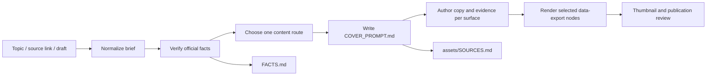

# Architecture

## Design principle

The system separates content judgment from deterministic rendering.



## Layers

### Instruction layer

- `SKILL.md` defines the end-to-end behavior and non-negotiable rules.
- `references/input-schema.md` turns loose user input into normalized fields.
- `references/content-routing.md` selects the evidence structure.
- `references/brand-system.md` defines surface, portrait, typography, and asset rules.

### Template layer

- `assets/templates/vertical.html` contains six 1080×1440 route nodes.
- `assets/templates/wechat.html` contains six independent 2100×900 + 1080×1080 pairs and six pair-preview nodes.
- Every deliverable root uses `data-export` and a stable `data-file` name.

### Asset layer

- `assets/portrait/` contains the default contextual and original portraits.
- `assets/brand/` contains internal prototype brand markers.
- `assets/SOURCES.md` is the visual-asset provenance ledger.
- `assets/COVER_PROMPT.template.md` becomes the project-level creative brief and portable cover prompt.
- `assets/FACTS.template.md` becomes a project-level `FACTS.md`.

### Runtime layer

- `scripts/new-cover-project.mjs` creates a non-overwriting project scaffold and validates all bundled asset references before making the target directory.
- `scripts/render-covers.mjs` selects export nodes, waits for fonts and images, renders PNG files, and verifies output dimensions.
- `scripts/validate-repo.mjs` checks repository structure and template invariants without external packages.

## Rendering fallback

```text
Installed Playwright available?
├── yes → Playwright locator screenshots
└── no  → local Chrome + DevTools Protocol
```

Both paths:

- disable animation and transitions;
- reset export alignment to the top-left;
- expand the viewport to the largest selected node;
- wait for images and fonts;
- verify PNG dimensions after capture.

## Selection model

`--only` normalizes and matches any of:

- `data-route`;
- `data-pair`;
- `data-preview-pair`;
- DOM `id`;
- `data-file`, with or without `.png`.

This lets one editable template hold multiple content routes while a production command exports only the requested deliverables.

## Trust boundary

The renderer validates geometry and files; it does not validate truth, copyright, privacy, or trademark permission.

Those remain explicit publication gates:

- facts and claims → `FACTS.md`;
- copy, composition, and visible design decisions → `COVER_PROMPT.md`;
- visual assets and terms → `assets/SOURCES.md`;
- personal stance and experience → user confirmation;
- public release → human review at thumbnail size.

## Future data contract

The next architectural step is a normalized `cover.json` consumed by all templates and a future web editor. The web layer should not fork the route logic or evidence policy.
