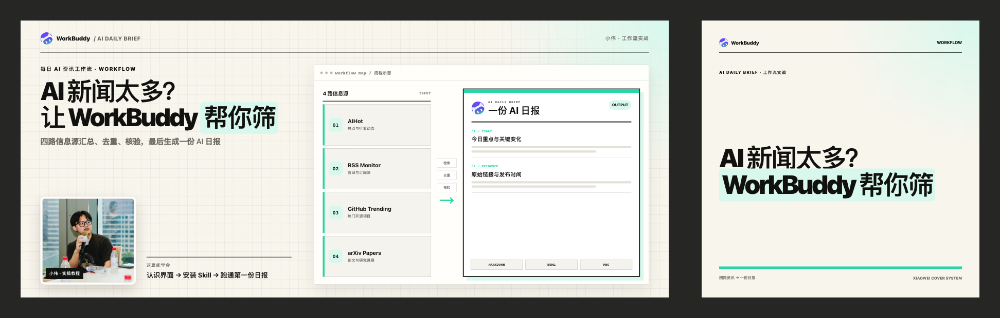

# 实际任务案例 / Maintainer case studies

[项目首页](../../README.md) · [可复用工作流与维护](../maintainer-workflow.md) · [OSS 申请材料](../oss/README.md)

这里收录两次作者自己的封面制作任务。两组任务的提示词、事实记录、HTML 和 PNG 在本次整理前已经存在，记录日期均为 **2026-08-27**；2026-09-16 将它们整理为公开案例。

它们证明同一套工作流曾被用于不同内容主题，不代表两位客户、两次外部采用或已发布文章的传播成绩。没有保留可公开的完整模型调用轨迹，因此不推断具体模型、Token 用量、生成耗时或节省比例。

| 案例 | 可复用的部分 | 公开证据 |
|---|---|---|
| [WorkBuddy AI 日报](workbuddy-ai-daily/README.md) | 从文章提取工作流，区分流程示意与真实产品界面，横版/方版独立排版 | 原任务提示词、历史事实记录、限定到该主题的 HTML、3 张原始 PNG |
| [邮箱地址与发信能力](email-routing/README.md) | 将抽象论点转换为三条决策路径，缩短方版标题，保留人物动作语境 | 原任务提示词、历史事实记录、限定到该主题的 HTML、3 张原始 PNG |

### WorkBuddy：四路信息源 → 一份日报

[](workbuddy-ai-daily/pair-preview.png)

### 邮箱：更多地址、独立账号、更多发送

[](email-routing/pair-preview.png)

## 如何核验

```bash
npm run verify:cases   # SHA-256、PNG 尺寸、资产引用、公开文本与清单完整性
npm run test:cases     # 上述检查 + 在临时目录重渲染两组 HTML
```

[manifest.json](manifest.json) 保存公开制品的 SHA-256、原文件摘要、记录日期和证据边界。6 张 PNG 按字节复制，没有为申请重新生图或修改。HTML 去掉未使用的示例主题并调整资产路径；提示词移除本机路径和私有文档链接。各案例的 `SOURCE.md` 逐项说明差异。

重渲染检查的是 HTML 可以执行和 PNG 尺寸正确；字体及浏览器版本可能改变像素，不把重新渲染与历史 PNG 的逐像素一致视为保证。

## 与固定演示的区别

[Claim-to-Pixel 演示](../../contest/README.md) 是固定输入的回归样例，明确声明 `liveAiClaimed:false`。它演示错误标题被拒绝、修正后生成制品、等待人工审阅。这两组历史案例早于该演示，不声称它们当时经过后来新增的八项契约校验。

## Rights and evidence boundary

These are two historical tasks by the maintainer, not third-party adoption. The six PNGs are unchanged historical outputs; the editable HTML and text records are explicitly curated copies. No live model transcript, usage benchmark, customer endorsement, or publication metrics are claimed. Portrait display is limited to this repository's examples. Product names and the WorkBuddy logo identify the tutorial subject and imply no endorsement. See each case's `SOURCE.md` and the repository [NOTICE](../../NOTICE.md).
