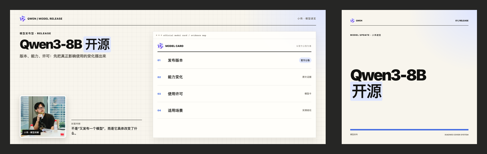
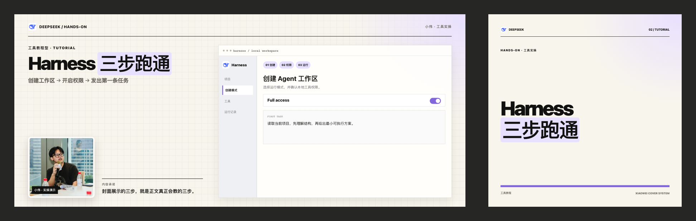
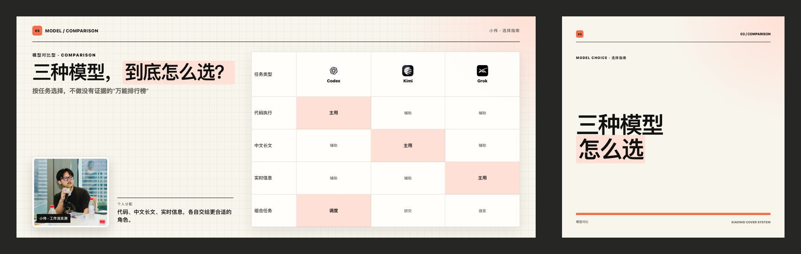
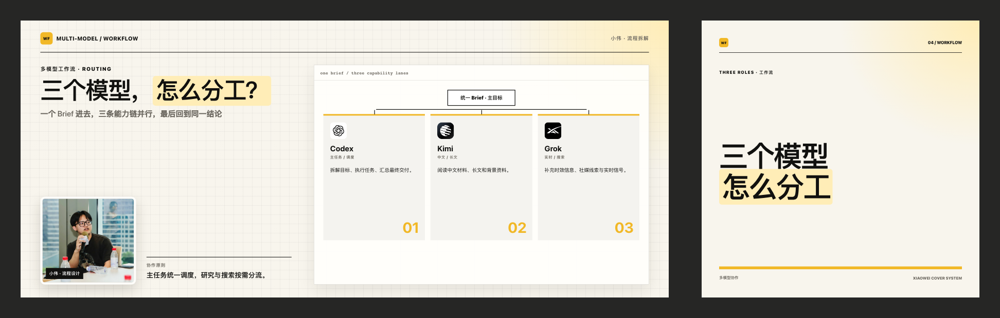
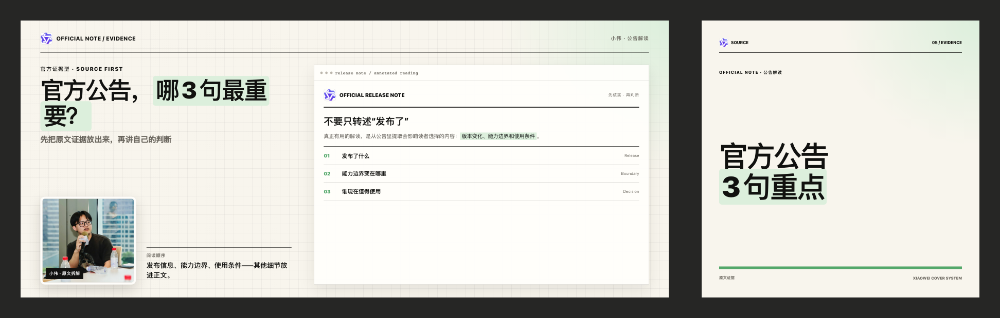
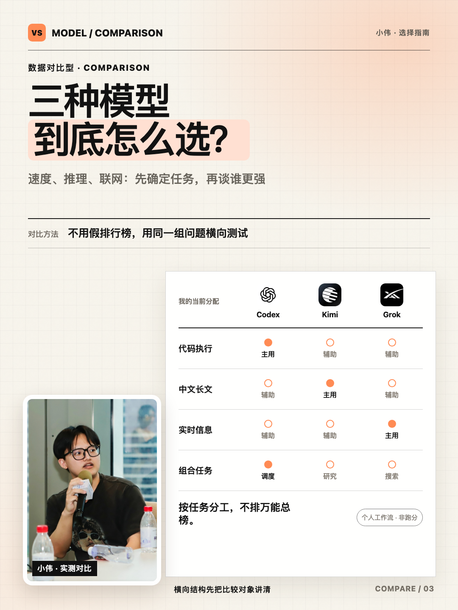
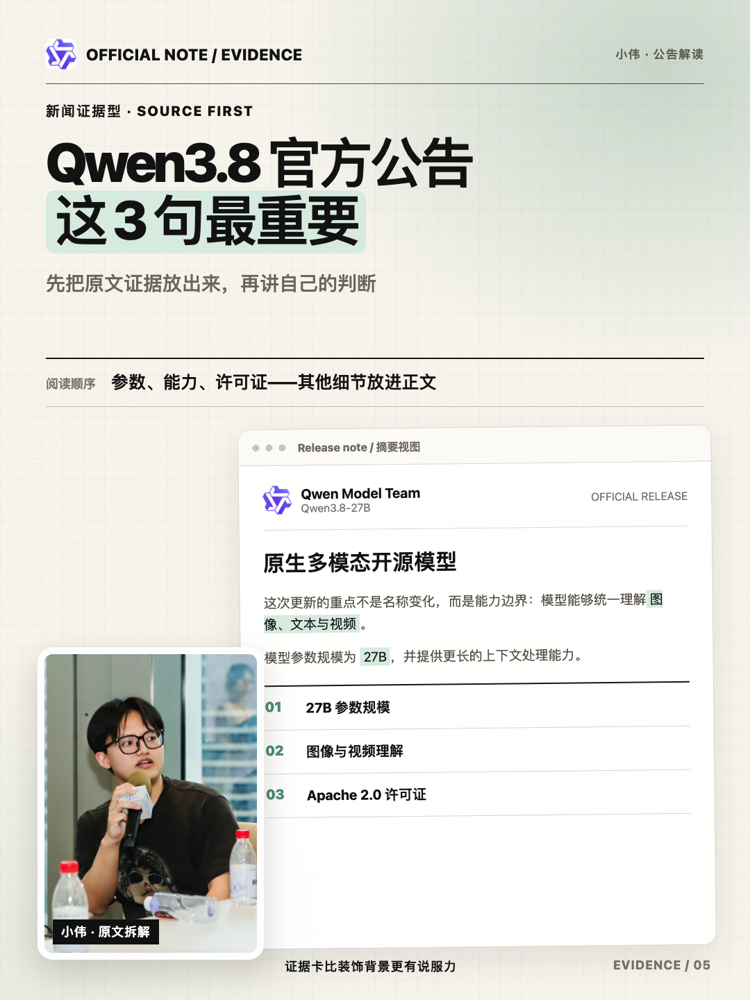

# 高清封面画廊

[返回 README](../README.md)

这里展示的是原始 PNG，不是压缩联系表。点击任意图片可查看 GitHub 中保存的完整分辨率。

## 公众号：横版 + 独立方版

公众号封面不是把一张图裁成两个比例。同一主题会分别设计 `2100×900` 主封面和 `1080×1080` 方封面，再生成 `1944×620` 配对检查图。

### 1. 模型发布

### 2. 工具教程

### 3. 模型对比

### 4. 多模型工作流

### 5. 官方资料解读

### 6. 现场复盘

公众号现场复盘的两个生产文件：

<table>
  <tr>
    <td width="65%"></td>
    <td width="35%"></td>
  </tr>
  <tr>
    <td align="center"><code>2100×900</code> 主封面</td>
    <td align="center"><code>1080×1080</code> 独立方封面</td>
  </tr>
</table>

## 小红书：六种内容结构

下面每张都是 `1080×1440` 原始 PNG。

<table>
  <tr>
    <td width="33%"></td>
    <td width="33%"></td>
    <td width="33%"></td>
  </tr>
  <tr>
    <td align="center">模型发布</td>
    <td align="center">工具教程</td>
    <td align="center">模型对比</td>
  </tr>
  <tr>
    <td width="33%"></td>
    <td width="33%"></td>
    <td width="33%"></td>
  </tr>
  <tr>
    <td align="center">多模型工作流</td>
    <td align="center">官方资料解读</td>
    <td align="center">现场复盘</td>
  </tr>
</table>

## 素材说明

- 人物照片由仓库所有者提供并明确授权用于本公开项目的展示；该授权不代表第三方可以把照片作为自己的身份素材复用。
- 产品名称和品牌图形仅用于说明对应模型或工具，不表示厂商合作或官方背书，也不随本仓库许可证重新授权。
- 每个正式任务仍应在 `assets/SOURCES.md` 记录素材来源，并在发布前核对当前品牌规则。
