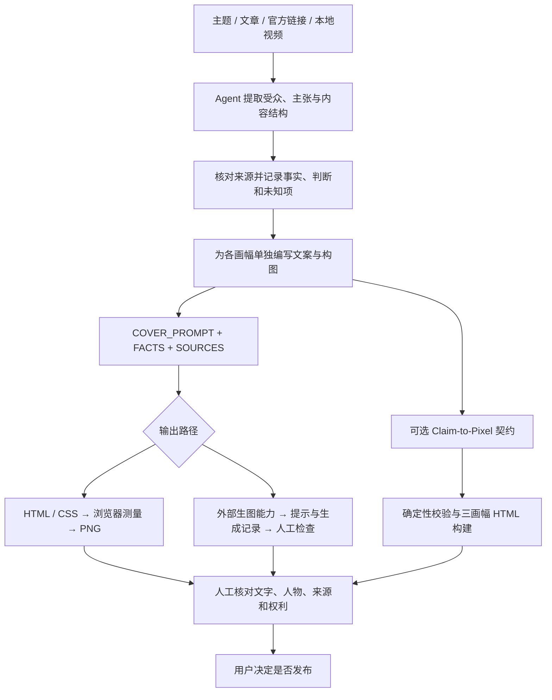

# 可复用工作流、可执行校验与维护任务

[首页](../README.md) · [实际案例](cases/README.md) · [OSS 申请材料](oss/README.md)

Claim2Cover 是由 Codex 执行的内容工作流和本地 Node.js 工具组成的项目。可复用的核心是任务拆解、证据记录、画幅决策、可编辑制品与回归验证；用户需要提供自己的主题和有权使用的素材。

## 1. 从输入到交付



| 阶段 | 可复用做法 | 可查看的文件 | 责任边界 |
|---|---|---|---|
| 明确任务 | 提取平台、受众、主题、必须/禁止元素 | [输入规范](../references/input-schema.md) | 需要 Agent 判断，脚本不会自动理解任意文章 |
| 内容路由 | 选择模型发布、教程、对比、工作流、资料解读或现场复盘结构 | [内容路由](../references/content-routing.md) | 六种结构不是六种配色 |
| 来源核对 | 记录可见事实、证据位置、日期与未核实项 | [事实模板](../assets/FACTS.template.md) | 记录存在不等于外部事实为真 |
| 按平台设计 | 每个比例单独安排标题、证据、人物与留白 | [画幅分流](../references/channel-routing.md) | 生图目标尺寸不等于已验证的实际输出尺寸 |
| 选择风格 | 指定或按 seed 选择，保存结果并拒绝无意覆盖已有 brief | [选择器](../scripts/select-cover-style.mjs) | seed 复现选择结果，不保证生成图像一致 |
| HTML 输出 | 选择 `data-export` 节点，等待字体/图片，检测标记区域溢出，验证 PNG 尺寸 | [渲染器](../scripts/render-covers.mjs) | 不检查所有视觉美感，也不检测所有未标记区域的遮挡 |
| 契约校验 | 核对结构、来源引用、标题风险词、画幅 brief、资产声明与审批状态 | [Claim-to-Pixel](../scripts/claim-to-pixel.mjs) | 规则覆盖有边界，不是通用事实核查器或版权判定器 |
| 最终交付 | PNG、HTML 或生成提示、事实记录和素材记录一起交付 | [两组历史案例](cases/README.md) | 不自动发文章，也不把渲染完成算作人工发布批准 |

### 最小复用方式

安装后给 Codex 一份自己的输入：

```text
使用 $generate-xiaowei-covers。
主题：<你的文章或资料>
受众：<读者>
平台：公众号横版与方版
必须表达：<一个核心结论>
不能宣称：<未验证的结果>
素材：<自己拥有或获准使用的图片>
请保留内容判断、来源记录、独立构图、可编辑文件和最终 PNG。
```

没有生图工具时可以使用 HTML 路径。已有 HTML 可独立调用 Node 渲染器；CLI 不会替代 Agent 撰写语义内容。依赖要求为 Node.js 20+ 和 Chrome 或 Playwright；视频采样另需 ffmpeg / ffprobe。

## 2. 已经能运行的验证

从仓库根目录执行；除明确的未来评估计划外，不消耗 API 额度。

| 命令 | 实际检查 | 明确不覆盖 |
|---|---|---|
| `npm run test:static` | JS 语法、入口文件、素材引用、frontmatter、模板导出节点、固定演示声明与公开日志路径 | 每种用户输入、外部服务、图像语义 |
| `npm run test:style` | 8 个风格配置、固定 seed 回放、比例计划、重复执行、错误参数与已有文件保护；当前脚本输出 16 组检查 | 实际生成的人脸、文字质量和模型稳定性 |
| `npm run test:render` | 真实临时项目渲染、精确 PNG 尺寸、标题溢出负例、Claim-to-Pixel 演示和状态测试 | 所有字体/系统组合、用户文章的正确性 |
| `npm run verify:cases` | 历史案例文件摘要、尺寸、HTML 资产、资料完整性与选定隐私模式 | 独立用户数量、历史生成时间、全文隐私识别 |
| `npm run test:cases` | 上述案例检查及负例测试，重渲染两组公开 HTML 的 6 个输出 | 历史 PNG 的逐像素重现、原文外部功能真实性 |
| `npm test` | 以上全部步骤；由 GitHub Actions 在 push / PR 上执行 | 付费模型的实时回归评估 |

现有契约测试包含可检查的失败路径：

- 未核实的“效率提升 10 倍”标题被拒绝。
- `110倍` 不能作为 `10倍` 的证据；声明的标题 token 必须出现在关联 claim 中。
- 主标题与 promise 区域都接受风险 token 校验。
- 待审状态不能通过 `release-check`。
- 审批后修改 payload 会触发摘要不一致；固定 demo 始终保留待人工审阅状态。
- 已存在的 build 输出目录被拒绝；风格选择器不覆盖已有用户 brief。

审批摘要是无密钥 SHA-256 一致性检查，不认证审阅者身份，也不能防止能同时修改内容和摘要的人伪造一致记录。自动化测试中的签核者标为测试身份，不替真人批准生产发布。直接调用底层渲染器可能覆盖同名 PNG，因此测试用临时目录，手动复用用新的输出路径。

## 3. 维护者具体做什么

| 触发情形 | 维护动作 | 可验收结果 |
|---|---|---|
| 用户报告标题被截断 | 用脱敏输入复现，定位安全区域，增加失败样例并修复布局 | 修复前失败、修复后通过；保留缩略图人工检查 |
| 新增平台或修改比例 | 更新 brief、样式与尺寸预期，检查现有画幅 | 新比例真实输出及已有画幅回归通过 |
| Chrome / Node 行为变化 | 检查启动、图片加载、字体等待、浏览器清理和错误信息 | CI 记录与最小复现；不把仅一台机器通过写成全平台支持 |
| 风格规则调整 | 检查选择状态复用和旧 brief 保护；人工查看新生成结果 | 配置测试通过；视觉验收单独记录 |
| 新增真实案例 | 核对授权、移除私有链接、记录原件与公开件差异 | manifest 对应实际文件；案例来源和限制明确 |
| 外部 PR 或问题出现 | 区分缺陷/需求/环境问题，审查修改，复现风险并更新文档 | 可追溯 Issue/PR 与相关测试；不虚构已有社区贡献 |
| 发布新版本 | 检查变更范围、许可证、资产来源和当前提交的 CI | CHANGELOG、明确验证范围、公开可读取的制品 |

## 4. 未来六个月的维护计划

这是计划，不是已经完成或收到资助的承诺。

1. **第 1–2 月：真实输入回归集。** 收集经授权的匿名问题，按内容路由、画幅和失败类型整理；记录环境、输入和可观察预期，不用演示数量冒充采用度。
2. **第 3–4 月：Agent 语义质量评估。** 在预算内用 API 比较“事实/判断/未知”的分类、标题是否引入额外承诺、各画幅是否真正独立。固定输入、保存模型与提示版本，人工复核样本。
3. **第 5–6 月：维护辅助。** 用 Codex 协助问题复现、候选补丁、回归用例和发布说明；真人保留合并和发布决定。按真实问题优先级推进，不为了申请添加无用功能。

计划评估指标：无依据数字承诺的漏检/误报、错误来源引用、未授权素材声明、画幅 brief 重复、结构化输出合法率，以及已标记区域的溢出数。这些指标尚无稳定基线，不承诺当前准确率或维护提速比例。

API 额度拟用于开源维护与评估，不用于补贴商业客户批量制图。现有确定性测试不需要模型 API；未来 API 评估应采用公开或获准使用的去身份化输入，并设置调用与费用上限。
